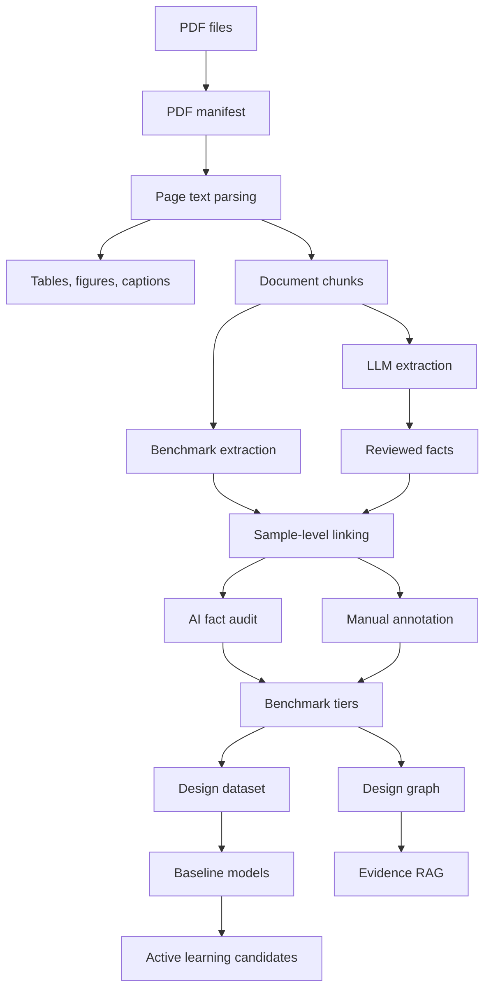

# HfO2-FerroKG 完整工作说明

更新时间：2026-05-27  
项目路径：`D:\KG agent\hfo2-ferro-kg`  
当前分支：`codex/benchmark-design-workflow`  
本地代码状态：以当前 Git 日志为准；本文档记录截至“人工标注界面 + 样品级关联 + RAG 持久任务 + 实时监控”完成后的工作状态。  

## 1. 项目定位

HfO2-FerroKG 是一个面向氧化铪基铁电材料的本地知识图谱与材料设计工作台。它的核心目标不是简单地整理 PDF，也不是只做一个问答机器人，而是把本地文献转化为可以追溯、可以审核、可以建模、可以用于实验设计的数据资产。

项目当前目标可以概括为：

```text
本地 PDF 文献
-> 文献登记
-> PDF 文本、表格、图注解析
-> HfO2 材料事实抽取
-> 样品级事实关联
-> AI 二次审核
-> 人工标注
-> benchmark 数据集
-> 知识图谱和设计图谱
-> 证据推理型 RAG
-> 主动学习和工艺推荐
```

本项目严格围绕 HfO2 / HZO / doped HfO2 铁电材料，不把 BaTiO3、PZT、BiFeO3 等其他铁电体系作为当前主线。

## 2. 要解决的科研问题

当前 HfO2 基铁电材料研究中，数据分散在大量论文、表格、图注和正文描述里。仅仅知道“材料名称”和“剩余极化强度”研究价值有限，因为铁电性能强烈依赖样品和工艺上下文。

真正需要解决的问题是：

1. 同一个性能值到底对应哪个材料体系。
2. 性能值是 Pr 还是 2Pr。
3. 性能值对应的薄膜厚度是多少。
4. 退火温度、时间和气氛是什么。
5. 上下电极和器件 stack 是什么。
6. 沉积方法是什么。
7. 器件类型是 FeCAP、FeFET、FTJ、MFM capacitor 还是其他结构。
8. 相结构是否为 orthorhombic / Pca21。
9. 性能值是否为 wake-up 后、疲劳后、低温下或特殊条件下的值。
10. 每一个结论能否回到论文页码和原文证据句。

因此项目从“事实抽取”升级为“样品级关联”，从“问答系统”升级为“证据推理系统”，从“知识图谱”升级为“设计图谱”，最后服务于材料设计和工艺优化。

## 3. 当前数据状态

截至本次整理，系统本地数据库快照如下：

| 项目 | 数量 |
|---|---:|
| PDF 记录 | 584 |
| 已解析 PDF | 582 |
| 解析页数 | 8595 |
| 表格数量 | 1231 |
| 图注和图片资产 | 14088 |
| 文档 chunk | 22526 |
| 高价值 chunk | 16630 |
| 结构化抽取候选 | 16630 |
| reviewed facts | 4153 |
| benchmark 抽取结果 | 21785 |
| benchmark 有效结果 | 16984 |
| 样品级关联事实 | 20633 |
| strong 样品级事实 | 6133 |
| partial 样品级事实 | 9187 |
| weak 样品级事实 | 5288 |
| LLM 文献卡片 | 584 |
| chunk 语义标签 | 17140 |
| AI 二次审核结果 | 4175 |
| AI 判定可用于建模 | 448 |
| AI 判定需要人工复核 | 546 |
| 实际记录 token | 299145418 |
| 实时估算 token | 307371912 |
| 实时估算费用 | 452.0229 CNY |
| 当前后台状态 | idle |

说明：

- `strong` 表示材料、性能、证据和关键样品上下文较完整，适合作为建模优先数据。
- `partial` 表示证据可追溯，但样品上下文不完整，适合探索性分析或人工补全。
- `weak` 表示证据链或上下文较弱，需要人工重点复核。
- AI 二次审核目前只完成部分样品级事实，后续可继续扩展到全量。

## 4. 技术架构

项目采用本地优先架构，避免把 PDF、数据库和 API key 上传到 GitHub 或云端任务。

主要技术栈：

| 层级 | 技术 |
|---|---|
| 语言 | Python 3.11+ |
| 本地 UI | Streamlit |
| 数据库 | SQLite |
| PDF 文本解析 | PyMuPDF |
| 表格抽取 | pdfplumber |
| LLM 接入 | OpenAI compatible client，当前接 DashScope / qwen3.7-max |
| 向量和检索 | 本地轻量索引、关键词检索、结构化事实检索 |
| 图谱导出 | CSV、HTML 可视化 |
| 机器学习 | sklearn baseline，tiered benchmark |
| 测试 | pytest |
| 版本管理 | Git / GitHub |

总体结构：



## 5. 数据安全和边界

本项目遵循以下安全规则：

1. PDF 原文放在 `data/raw_pdfs/`，不提交 GitHub。
2. SQLite 数据库、向量库、模型文件、运行日志和导出数据默认不提交 GitHub。
3. API key 只能放在环境变量或 `.env`，不能写进代码、文档、日志或提交记录。
4. 不做 Sci-Hub 自动下载脚本，不自动访问付费全文数据库。
5. RAG 回答必须引用已有证据，不允许编造 DOI、数值或论文。
6. 未经人工确认的数据不能直接作为论文正式结论。
7. 允许 AI 大量参与抽取、审核和推理，但所有结果必须保留证据链。

## 6. 已完成模块总览

### 6.1 PDF 文献入库

相关文件：

- `backend/services/pdf_manifest.py`
- `pipelines/01_build_manifest.py`
- `app/pages/1_PDF_文献入库.py`

完成内容：

1. 扫描本地 PDF 文件夹。
2. 记录 PDF 文件名、路径、大小、页数、哈希。
3. 建立 `pdf_files` 表。
4. 标记重复 PDF。
5. 支持 Streamlit 页面查看文献清单。

方法：

- 使用文件系统扫描获取 PDF。
- 使用 SHA256 计算文件身份。
- 使用 PyMuPDF 读取页数。
- 失败文件只记录错误，不中断批处理。

### 6.2 PDF 文本解析

相关文件：

- `backend/services/pdf_parser.py`
- `pipelines/02_parse_pdfs.py`
- `app/pages/2_PDF_解析.py`

完成内容：

1. 使用 PyMuPDF 逐页抽取文本。
2. 保存到 `parsed_pages` 表。
3. 记录页码、字符数和解析状态。
4. 识别文本过短页面和疑似 OCR 页面。
5. 初步抽取 DOI、标题、年份。

方法：

- 每页独立解析，保留页码。
- 根据文本长度、空页比例计算解析质量。
- OCR 当前不自动执行，只标记需要 OCR。

### 6.3 表格、图注和图片资产解析

相关文件：

- `backend/services/table_extractor.py`
- `backend/services/visual_asset_parser.py`
- `pipelines/03_extract_tables.py`
- `pipelines/15_extract_visual_assets.py`

完成内容：

1. 从 PDF 中抽取表格。
2. 从页面中抽取图注和图片资产信息。
3. 将表格和图注作为后续 LLM 抽取的重要证据来源。

方法：

- 表格使用 pdfplumber。
- 图片和图注先以页面上下文、caption 和位置为主。
- 当前暂不做完整多模态图像理解，后续可接入多模态模型。

### 6.4 文档 chunk 切分

相关文件：

- `backend/services/chunker.py`
- `pipelines/04_chunk_documents.py`

完成内容：

1. 将每篇论文按页、段落和 section 切成 chunk。
2. 标记是否包含 HfO2、工艺、性能、相结构关键词。
3. 高价值 chunk 优先送入 LLM。

方法：

- chunk 控制在适合 LLM 输入的长度。
- 保留 `paper_id`、`pdf_id`、`page_number`、`section` 和原文。
- references 区域尽量降低抽取优先级。

### 6.5 HfO2 结构化抽取

相关文件：

- `backend/schemas/hfo2_extraction_schema.py`
- `backend/services/hfo2_extractor.py`
- `backend/services/hfo2_parallel_extractor.py`
- `pipelines/05_run_extraction.py`

抽取对象：

1. 材料体系。
2. 掺杂元素和掺杂浓度。
3. HZO 组分比例。
4. 薄膜厚度。
5. 沉积方法。
6. 退火温度、时间、气氛。
7. 上下电极、substrate、device stack。
8. 相结构。
9. Pr、2Pr、Ec、endurance、retention、memory window 等性能。
10. 证据句和页码。

方法：

- 使用 LLM + JSON schema。
- 使用 Pydantic 严格校验。
- 抽取结果先进入候选区。
- 缺少证据句、页码、材料或性能的结果不能直接作为高质量事实。

### 6.6 质量校验和事实标准化

相关文件：

- `backend/services/fact_normalizer.py`
- `backend/services/quality_validator.py`
- `pipelines/06_normalize_facts.py`
- `pipelines/10_validate_results.py`

完成内容：

1. 标准化材料名称。
2. 标准化属性名。
3. 标准化单位。
4. 检查 Pr 和 2Pr 混淆。
5. 标记异常数值。

重点规则：

- `Pr` 和 `2Pr` 必须分开存。
- `2Pr` 不能自动当成 `Pr`。
- 如果需要从 `2Pr` 派生 `Pr`，必须标记派生规则。
- `Pr > 100 μC/cm²`、`2Pr > 200 μC/cm²`、`Ec > 10 MV/cm` 需要重点检查。

### 6.7 抽取结果审核

相关文件：

- `backend/services/review_service.py`
- `app/pages/4_抽取结果审核.py`

完成内容：

1. 显示候选事实。
2. 支持点击 fact_id 切换当前审核对象。
3. 显示原文 chunk、证据句、论文信息、PDF 打开入口。
4. 支持修改审核状态和备注。
5. 支持打开本地 PDF。

审核状态：

- `pending`
- `preapproved_machine`
- `needs_human_review`
- `approved`
- `rejected`

### 6.8 样品级事实关联

相关文件：

- `backend/services/sample_linker.py`
- `pipelines/23_link_sample_facts.py`

完成内容：

将原本松散的性能事实升级为样品级事实：

```text
性能值
-> 材料体系
-> 样品
-> 厚度
-> 退火
-> 电极 stack
-> 沉积方法
-> 器件类型
-> 相结构
-> wake-up / endurance 状态
-> 证据句
```

方法：

- 对 reviewed facts 和 benchmark facts 进行统一关联。
- 使用规则 + LLM 结合。
- LLM 根据同一 chunk、同页上下文、相邻 chunk、表格和图注判断性能值对应的样品条件。
- 输出 `sample_property_links` 表。

关联质量分层：

- `strong`：样品条件完整，适合建模和正式分析。
- `partial`：证据可追溯，但样品上下文缺失部分字段。
- `weak`：证据或上下文较弱，需要人工标注。
- `ambiguous`：多个样品或条件难以区分。

### 6.9 LLM 文献卡片

相关文件：

- `backend/services/literature_card.py`
- `pipelines/26_build_literature_cards.py`

完成内容：

每篇 PDF 生成一张 LLM 文献卡片，包含：

1. 研究类型。
2. 材料体系。
3. 核心样品。
4. 主要性能。
5. 关键图表。
6. 是否综述、理论、计算或实验。
7. 论文标题修复。

用途：

- 辅助 RAG 使用更准确的论文标题。
- 辅助判断综述二手值和原始实验值。
- 为后续文献级筛选和报告生成做准备。

### 6.10 chunk 语义分层

相关文件：

- `backend/services/chunk_semantic_labeler.py`
- `pipelines/27_label_chunks_semantically.py`

完成内容：

对 chunk 做 LLM 语义标注：

- 方法。
- 结果。
- 机理讨论。
- 图注。
- 表格。
- 综述引用。
- 理论计算。
- 器件性能。

用途：

- 提高 RAG 检索质量。
- 区分原始实验值和综述引用。
- 为后续多模态或图表抽取做准备。

### 6.11 AI 二次审核

相关文件：

- `backend/services/ai_fact_auditor.py`
- `pipelines/28_ai_audit_sample_links.py`

完成内容：

AI 对样品级事实做二次审核，输出：

- `ai_review_status`
- `risk_flags`
- `repair_suggestion`
- `usable_for_model`
- `usable_for_paper_claims`
- `reasoning_summary`

重点检查：

1. Pr / 2Pr 混淆。
2. 单位错误。
3. 综述二手引用。
4. 图中估读。
5. 低温特殊值。
6. fatigue 后值。
7. wake-up 后值。
8. 样品条件错配。
9. 缺少厚度、电极、退火等关键字段。

### 6.12 人工标注界面

相关文件：

- `backend/services/manual_annotation_service.py`
- `app/pages/13_人工标注.py`

页面链接：

```text
http://127.0.0.1:8501/人工标注
```

完成内容：

1. 提供一个简单人工标注页面。
2. 默认进入 `2Pr` 标注队列。
3. 支持筛选人工状态、性能类型、关联质量。
4. 支持搜索 DOI、标题、材料、证据句和 link_id。
5. 左侧显示证据句、原文 chunk 和 AI 风险提示。
6. 右侧可以修改材料、性能、数值、单位、厚度、退火、电极、器件、相结构、证据句和备注。
7. 标注默认保存到 `manual_annotations`，不覆盖原始抽取。
8. 勾选“应用到样品级关联数据”后，才会改写 `sample_property_links`，影响后续 RAG、图谱和模型。

人工状态：

- `unchecked`：未检查。
- `correct`：确认正确。
- `fixed`：人工修正。
- `uncertain`：不确定。
- `reject`：剔除。

设计原则：

- 原始抽取结果保留。
- 人工修改有独立记录。
- 高风险应用需要显式勾选。
- 后续可以扩展为多人标注和一致性评估。

### 6.13 benchmark 抽取

相关文件：

- `backend/services/benchmark_extractor.py`
- `pipelines/19_open_benchmark_extraction.py`
- `pipelines/29_build_benchmark_tiers.py`

完成内容：

1. 不完全依赖原始本体，使用更开放的抽取策略。
2. 对 HfO2 铁电相关数据做更宽覆盖。
3. 构建 benchmark 分层。

benchmark 三层：

- `strong_only`：高可信，用于正式图表和高质量模型。
- `strong_partial`：覆盖更广，用于探索模型。
- `all_traceable`：所有可追溯事实，用于 RAG 线索和人工复核。

### 6.14 知识图谱和设计图谱

相关文件：

- `backend/services/graph_builder.py`
- `backend/services/design_graph.py`
- `backend/services/graph_visualizer.py`
- `pipelines/07_build_graph.py`
- `pipelines/17_export_graph_html.py`
- `pipelines/24_build_design_graph.py`
- `app/pages/5_知识图谱浏览.py`

知识图谱节点：

- Paper
- PDFFile
- HafniaMaterial
- ThinFilmSample
- Dopant
- PhaseStructure
- FabricationProcess
- Electrode
- Substrate
- Device
- FerroelectricProperty
- Evidence

设计图谱进一步区分：

- 可控变量：材料、掺杂、厚度、沉积、退火、电极、器件结构。
- 目标变量：2Pr、Pr、Ec、endurance、retention、memory window、leakage。
- 约束变量：温度窗口、工艺可实现性、器件结构、可靠性。
- 机制变量：相结构、应力、氧空位、电极氧库效应、晶粒尺寸。
- 证据：论文、页码、证据句。

### 6.15 RAG 问答

相关文件：

- `backend/services/rag_answerer.py`
- `backend/services/rag_job_service.py`
- `scripts/run_rag_job.py`
- `app/pages/6_RAG_问答.py`

完成内容：

1. 从普通 RAG 升级为证据推理型 RAG。
2. 回答优先查询样品级事实和 benchmark 分层。
3. 再使用 LLM 组织自然语言答案。
4. 每个关键结论附 fact_id、论文标题、DOI、页码、证据句、样品条件。
5. 范围类问题区分 `strong_only`、`strong_partial`、`all_traceable`。
6. 如果 LLM 失败，自动退回本地结构化回答。
7. 问答现在是后台任务，不会因为切换页面而中断。

RAG 的设计原则：

- 不直接依赖 LLM 记忆。
- 不编造 DOI、数值和文献。
- 对 Pr 和 2Pr 强制区分。
- 对低温、疲劳后、wake-up 后等特殊条件做风险提示。

### 6.16 数据分析看板

相关文件：

- `backend/services/analytics.py`
- `app/pages/7_数据分析看板.py`

完成内容：

1. 文献年份分布。
2. 材料体系分布。
3. property 分布。
4. 退火、厚度、电极、相结构与性能关系图。
5. 图表数据优先使用 accepted facts。

### 6.17 多模型数据验证

相关文件：

- `backend/services/multi_model_validator.py`
- `app/pages/10_多模型数据验证.py`
- `pipelines/18_multi_model_validate_dataset.py`

目标：

使用多个模型或多轮 LLM 判断同一数据集，观察不同模型对事实准确性、可用性和风险的判断差异。

可视化方向：

- 各模型准确率。
- 各模型一致率。
- 各类风险标签分布。
- 不同材料体系的数据质量差异。

### 6.18 实时任务监控

相关文件：

- `backend/services/progress_monitor.py`
- `scripts/serve_monitor.py`
- `app/pages/11_任务实时监控.py`

完成内容：

1. 独立 8502 实时监控页面。
2. 页面不整体刷新，只局部刷新数字。
3. 显示运行时间、剩余时间、速度。
4. 显示真实 token、估算 token、当前批次 token。
5. 显示真实费用、估算费用、实时估算费用。
6. 显示最新日志和后台任务。
7. 没有后台任务时显示 `idle`，不再显示旧任务的剩余时间。

当前链接：

```text
http://127.0.0.1:8502/
```

## 7. 关键数据库表

### `pdf_files`

记录 PDF 文件信息：

- pdf_id
- file_name
- file_path
- sha256
- page_count
- parse_status
- parse_quality_score
- ocr_needed

### `parsed_pages`

记录每页文本：

- page_id
- paper_id
- pdf_id
- page_number
- text
- char_count

### `document_chunks`

记录 chunk：

- chunk_id
- paper_id
- pdf_id
- page_number
- section
- text
- is_high_value
- contains_property_keyword

### `reviewed_facts`

记录机器预审和人工审核事实：

- fact_id
- paper_id
- pdf_id
- chunk_id
- page_number
- fact_type
- payload_json
- review_status
- reviewer_notes

### `benchmark_extractions`

记录 benchmark 抽取：

- extraction_id
- paper_id
- pdf_id
- chunk_id
- page_number
- source_type
- payload_json
- model_name
- status

### `sample_property_links`

记录样品级关联事实：

- link_id
- source_kind
- source_id
- paper_id
- pdf_id
- chunk_id
- page_number
- sample_id
- material_json
- sample_json
- phase_json
- property_json
- evidence_text
- context_quality
- context_score

### `ai_fact_audits`

记录 AI 二次审核：

- audit_id
- link_id
- ai_review_status
- risk_flags_json
- repair_suggestion
- usable_for_model
- usable_for_paper_claims
- reasoning_summary

### `manual_annotations`

记录人工标注：

- annotation_id
- link_id
- annotation_status
- corrected_material_json
- corrected_sample_json
- corrected_phase_json
- corrected_property_json
- corrected_evidence_text
- corrected_context_quality
- reviewer_notes
- applied_to_source

### `rag_jobs`

记录后台 RAG 问答：

- job_id
- question
- use_llm
- llm_model
- status
- answer_markdown
- error_message

## 8. 本地页面说明

| 页面 | 作用 |
|---|---|
| Home | 项目总览 |
| 本体构建 | HfO2 本体和 ontology 管理 |
| PDF 文献入库 | PDF 清单、入库和状态 |
| PDF 解析 | 文本解析和解析质量 |
| HfO2 信息抽取 | LLM 抽取入口 |
| 抽取结果审核 | 事实审核、原文追溯、PDF 打开 |
| 知识图谱浏览 | 图谱和 HTML 可视化 |
| RAG 问答 | 证据推理型问答 |
| 数据分析看板 | 统计图和趋势分析 |
| PDF 原文预览 | 本地 PDF 预览 |
| 文献补充 | 开放文献补充入口 |
| 多模型数据验证 | 多模型质量比较 |
| 任务实时监控 | 运行进度和 token/费用 |
| 材料设计工作流 | 从数据到设计推荐的流程 |
| 人工标注 | 简化人工修正和标注页面 |

## 9. LLM 的使用方式

项目中 LLM 主要用于：

1. 从 chunk 中抽取结构化事实。
2. 对表格和图注做标准化。
3. 构建文献卡片。
4. 对 chunk 做语义分类。
5. 将性能值和样品条件关联。
6. 对事实做二次审核。
7. 在 RAG 中组织证据回答。
8. 为材料设计候选给出解释和风险提示。

LLM 使用原则：

- 大量使用，但不盲信。
- 所有 LLM 输出必须有结构化 JSON。
- 所有关键事实必须保留证据句、页码、paper_id 和 pdf_id。
- 对不确定结果标记 `needs_human_review` 或 `weak`，不直接进入强数据集。
- API key 不进入代码和文档。

当前主要模型：

```text
DashScope compatible endpoint
model: qwen3.7-max
```

文档不记录任何 API key。

## 10. 材料设计工作流

当前项目正在从“抽取工具”升级为“材料设计工作台”。完整设计闭环如下：

```text
文献证据
-> 样品级事实
-> 数据质量分层
-> benchmark 数据集
-> baseline 模型
-> 不确定性估计
-> 主动学习候选
-> 人工标注和实验反馈
-> 重新训练
```

输入变量：

- 材料体系。
- 掺杂元素。
- HZO 比例。
- 薄膜厚度。
- 沉积方法。
- 退火温度。
- 退火时间。
- 退火气氛。
- 电极 stack。
- 器件类型。
- 相结构。
- wake-up / endurance 状态。

目标变量：

- 2Pr。
- Pr。
- Ec。
- endurance。
- retention。
- leakage current density。
- memory window。

约束变量：

- 工艺温度窗口。
- 器件结构可实现性。
- 可靠性。
- 厚度范围。
- 电极兼容性。
- 数据证据质量。

主动学习候选选择逻辑：

```text
推荐优先级 = 高预测性能 + 高不确定性 + 可实验实现 + 有相似文献证据 + 风险可控
```

## 11. 测试和验证

当前测试体系覆盖：

1. PDF manifest。
2. PDF parsing。
3. chunker。
4. HfO2 schema。
5. normalizer。
6. graph builder。
7. RAG answerer。
8. RAG background jobs。
9. literature cards。
10. chunk semantic labels。
11. design dataset。
12. manual annotation service。

最近一次测试结果：

```text
67 passed
```

## 12. 当前已知问题

1. GitHub 推送有时失败，原因是本机到 `github.com:443` 的网络或 TLS 连接不稳定。
2. 一些 PDF 标题仍可能来自首页占位文本，需要文献卡片和标题修复继续覆盖。
3. 仍有 weak 样品级事实较多，需要人工标注和 AI 二次审核继续提升质量。
4. 部分理论论文和综述论文的数据需要单独标记，避免混入实验 benchmark。
5. 当前图像内容主要通过图注和上下文处理，尚未做完整多模态图像理解。
6. 真实模型训练需要优先使用 `strong_only` 和人工确认后的 `fixed/correct` 数据。

## 13. 后续持续完善计划

### 阶段 A：数据质量闭环

1. 继续 AI 二次审核全量样品级事实。
2. 优先人工标注 2Pr、Pr、Ec、厚度、退火、电极和相结构。
3. 将人工标注结果合并到样品级事实。
4. 重新构建 benchmark tiers。

### 阶段 B：证据推理增强

1. RAG 回答按 strong/partial/all_traceable 分层。
2. 对范围问题输出正值范围、特殊条件范围和异常值说明。
3. 每条回答自动列出 fact_id、DOI、页码和证据句。
4. 对证据不足的问题明确回答“当前数据库没有足够证据”。

### 阶段 C：设计图谱增强

1. 强化变量角色：
   - controllable。
   - target。
   - constraint。
   - mechanism。
   - evidence。
2. 将设计图谱导出为可缩放 HTML。
3. 将图谱节点和人工标注结果联动。

### 阶段 D：模型和主动学习

1. 构建 strong_only 数据集。
2. 构建 strong_partial 数据集。
3. 对 2Pr、Pr、Ec、endurance、memory window 分别训练 baseline。
4. 输出 MAE、RMSE、R2。
5. 输出主动学习候选：
   - 推荐材料。
   - 推荐厚度。
   - 推荐退火。
   - 推荐电极。
   - 预测性能。
   - 不确定性。
   - 相似文献证据。
   - 风险提示。

### 阶段 E：报告和论文输出

1. 生成年度文献覆盖统计。
2. 生成材料体系对比报告。
3. 生成工艺和性能关系图。
4. 生成候选实验方案表。
5. 生成 PPT 和 Markdown 进展报告。

## 14. 推荐日常使用流程

### 查看当前状态

打开：

```text
http://127.0.0.1:8502/
```

查看：

- 后台任务是否运行。
- token 和费用。
- 样品级关联数量。
- AI 审核数量。

### 人工标注

打开：

```text
http://127.0.0.1:8501/人工标注
```

推荐顺序：

1. 先标注 `double_remanent_polarization_2Pr`。
2. 再标注 `remanent_polarization_Pr`。
3. 再标注 `coercive_field_Ec`。
4. 优先处理 `strong` 和 `partial`。
5. 对明显错误、非 HfO2、综述二手值标记为 `reject` 或 `uncertain`。
6. 对确认正确的数据标记为 `correct`。
7. 对修正后的数据标记为 `fixed`。
8. 只有确认后才勾选“应用到样品级关联数据”。

### RAG 问答

打开：

```text
http://127.0.0.1:8501/RAG_问答
```

推荐问题：

1. HZO 的 2Pr 范围是多少？
2. La 掺杂 HfO2 常见退火温度是多少？
3. 哪些论文报道了 orthorhombic Pca21 相？
4. TiN 电极相关的 HfO2 铁电性能有哪些？
5. HfO2 基 FeFET 的 memory window 有哪些报道？
6. 薄膜厚度低于 10 nm 时 2Pr 和 Ec 有什么趋势？

## 15. 当前交付物

当前已经具备：

1. 本地 PDF 文献数据库。
2. PDF 页面文本数据库。
3. 表格和图注资产。
4. HfO2 chunk 数据库。
5. HfO2 结构化事实候选。
6. reviewed facts。
7. benchmark 抽取结果。
8. 样品级关联事实。
9. LLM 文献卡片。
10. chunk 语义标签。
11. AI 二次审核表。
12. 人工标注页面。
13. 知识图谱和设计图谱基础。
14. 证据推理型 RAG。
15. 实时任务监控和 token/费用统计。
16. 数据分析看板。
17. baseline 和主动学习代码基础。

## 16. 结论

HfO2-FerroKG 当前已经从最初的“本地 PDF 解析工具”扩展为一个围绕 HfO2 基铁电材料的证据驱动材料设计工作台。它的核心价值不在于把文献简单问答化，而在于把分散文献中的材料、样品、工艺、相结构和性能建立可追溯关联。

下一步最重要的工作是提高数据质量：

1. 继续 AI 二次审核。
2. 使用人工标注页面修正关键事实。
3. 重建 benchmark tiers。
4. 用 strong_only 和 strong_partial 训练模型。
5. 输出可实验实现的主动学习候选。

当人工标注和样品级关联质量进一步提高后，这个项目就可以支撑更严肃的 HfO2 铁电材料设计问题，例如：

- 哪些可控变量最影响 2Pr？
- 哪些工艺组合能在低热预算下稳定 orthorhombic phase？
- 哪些电极 stack 更有利于高 2Pr 和高 endurance？
- 对低厚度 HZO，如何平衡 2Pr 和 Ec？
- 哪些未充分探索的组合值得优先实验？
