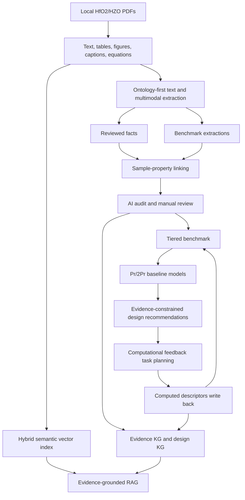

# HfO2-FerroKG 论文原型说明

## Research Question

How can HfO2/HZO ferroelectric literature be converted into a sample-level, evidence-traceable, model-ready knowledge graph for process optimization and material design?

本原型只覆盖 HfO2/HZO/doped HfO2 铁电材料。BaTiO3、PZT、BiFeO3 等体系不进入第一版主线。

## Core Contributions

1. Ontology-first extraction: 用 HfO2 领域本体约束材料、样品、工艺、相结构、器件、可靠性、机理和计算描述符抽取。
2. Multimodal evidence alignment: 用页面坐标连接正文、表格、图片、图注和公式，并阻止图中目测值直接进入强 benchmark。
3. Sample-property linking: 以 `sample_property_links` 为论文主数据表，把性能和可靠性结果绑定到厚度、退火、电极、相结构、状态和证据页码。
4. Tiered benchmark: 固定输出 `strong_only`、`strong_partial`、`all_traceable` 三层数据集，论文主结果优先使用前两层。
5. Hybrid evidence RAG: 结构化事实检索结合正文、表格、图注、公式和多模态语义向量，回答必须回到来源和页码。
6. Validation and computation loop: Pr/2Pr 作为首个可量化验证锚点，同时扩展可靠性、机理与计算描述符，并把候选转化为 DFT/TEFS 任务和结果回写。

## Method Figure



## Current Baseline

| Metric | Value |
| --- | ---: |
| PDF records | 1172 |
| Parsed PDFs | 1120 |
| Parsed pages | 14560 |
| Tables | 2178 |
| Images | 13712 |
| Geometric figure captions | 8267 |
| Equation candidates | 11774 |
| Document chunks | 39417 |
| High-value chunks | 27681 |
| publication v2.3 evidence chunks | 25661 |
| Reviewed facts | 3876 |
| Benchmark extractions | 21785 |
| Sample-property links | 20633 |
| Strong sample-property links | 6133 |
| Partial sample-property links | 9187 |
| Weak sample-property links | 5288 |
| LLM literature cards | 584 |
| LLM chunk labels | 17177 |
| AI fact audits | 4180 |
| Design dataset rows | 18122 |
| strong_only rows | 2104 |
| strong_partial rows | 9079 |
| all_traceable rows | 17913 |
| PaddleOCR Markdown completed | 0 |
| Semantic embedding smoke | 10 / 46831 planned documents |

## Primary Result Tables

Report these tables for the paper prototype:

1. Corpus and extraction scale: PDF, pages, tables, chunks, extraction candidates, reviewed facts, sample links.
2. Benchmark tiers: `strong_only`, `strong_partial`, `all_traceable`.
3. Pr/2Pr model metrics on `strong_only`: rows, MAE, RMSE, R2, baseline MAE, improvement.
4. AI audit and risk review: `usable_for_model`, `usable_for_rag_only`, `needs_human_review`, `reject`.
5. Gold set evaluation: extraction precision/recall/F1, sample-property linking accuracy, Pr/2Pr confusion rate, unit normalization error rate.
6. Computational feedback plan: task counts by family, required inputs, expected descriptors, KG write-back fields, benchmark write-back fields.

## Gold Set Evaluation

Run:

```bash
python3 pipelines/32_evaluate_paper_prototype.py --sample-size 30
```

First run creates:

```text
data/evaluation/hfo2_paper_gold_set_template.csv
```

Manually fill the `gold_*` columns for material family, thickness, deposition, annealing temperature/time/atmosphere, electrode stack, device type, phase, Pr/2Pr target, value, unit, and page number. Re-run the same command to generate:

```text
data/evaluation/paper_prototype_eval_summary.json
data/evaluation/paper_prototype_eval_details.csv
data/evaluation/paper_prototype_eval_report.md
```

## LLM and Safety Boundary

Use DashScope through the OpenAI-compatible interface:

```text
HFO2_FERROKG_LLM_PROVIDER=dashscope
HFO2_FERROKG_LLM_MODEL=qwen3.7-max
DASHSCOPE_API_BASE_URL=https://dashscope.aliyuncs.com/compatible-mode/v1
```

`DASHSCOPE_API_KEY` or `OPENAI_API_KEY` must stay in environment variables or `.env`. Do not read, copy, commit, or quote the local API key configuration document.

## Acceptance Checklist

- `pytest` passes.
- `python3 pipelines/10_validate_results.py` produces evidence and anomaly checks.
- `python3 pipelines/60_audit_corpus_coverage.py` freezes corpus and multimodal coverage counts.
- `python3 pipelines/52_build_publication_extraction_queue.py` refreshes the v2.3 publication queue.
- `python3 pipelines/61_build_semantic_vector_index.py` builds the resumable full semantic index after extraction is frozen.
- `python3 pipelines/21_build_design_dataset.py` refreshes the design dataset.
- `python3 pipelines/29_build_benchmark_tiers.py` refreshes benchmark tiers.
- `python3 pipelines/30_train_tiered_design_models.py --targets remanent_polarization_Pr,double_remanent_polarization_2Pr` refreshes primary model metrics.
- `python3 pipelines/32_evaluate_paper_prototype.py --sample-size 30` creates or evaluates the paper gold set.
- `python3 pipelines/34_plan_computational_feedback.py --max-candidates 20 --max-tasks 80` creates the computation feedback task plan without launching jobs.
