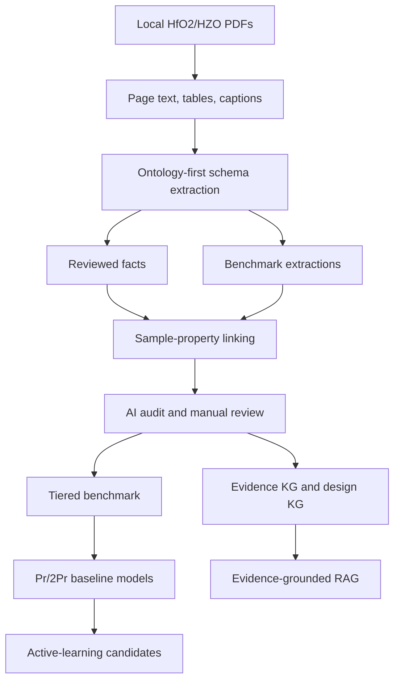

# HfO2-FerroKG 论文原型说明

## Research Question

How can HfO2/HZO ferroelectric literature be converted into a sample-level, evidence-traceable, model-ready knowledge graph for process optimization and material design?

本原型只覆盖 HfO2/HZO/doped HfO2 铁电材料。BaTiO3、PZT、BiFeO3 等体系不进入第一版主线。

## Core Contributions

1. Ontology-first extraction: 用 HfO2 领域本体约束材料、样品、工艺、相结构、器件和性能抽取。
2. Sample-property linking: 以 `sample_property_links` 为论文主数据表，把 Pr/2Pr 等性能绑定到厚度、退火、电极、相结构和证据页码。
3. Tiered benchmark: 固定输出 `strong_only`、`strong_partial`、`all_traceable` 三层数据集，论文主结果优先使用 `strong_only` 和 `strong_partial`。
4. Evidence-grounded RAG: RAG 回答必须回到 fact/link id、论文、页码、证据句和样品条件。
5. Baseline design model: 以 Pr 和 2Pr 为第一目标，报告 strong_only 上的 MAE、RMSE、R2 和相对 baseline improvement。

## Method Figure



## Current Baseline

| Metric | Value |
| --- | ---: |
| PDF records | 584 |
| Parsed PDFs | 582 |
| Parsed pages | 8595 |
| Tables | 1231 |
| Document chunks | 22526 |
| Extraction candidates | 16630 |
| Reviewed facts | 4153 |
| Benchmark extractions | 21785 |
| Sample-property links | 20633 |
| Strong sample-property links | 6133 |
| Partial sample-property links | 9187 |
| Weak sample-property links | 5288 |
| LLM literature cards | 584 |
| LLM chunk labels | 17177 |
| AI fact audits | 4180 |
| Design dataset rows | 12297 |
| strong_only rows | 992 |
| strong_partial rows | 4731 |
| all_traceable rows | 12168 |

## Primary Result Tables

Report these tables for the paper prototype:

1. Corpus and extraction scale: PDF, pages, tables, chunks, extraction candidates, reviewed facts, sample links.
2. Benchmark tiers: `strong_only`, `strong_partial`, `all_traceable`.
3. Pr/2Pr model metrics on `strong_only`: rows, MAE, RMSE, R2, baseline MAE, improvement.
4. AI audit and risk review: `usable_for_model`, `usable_for_rag_only`, `needs_human_review`, `reject`.
5. Gold set evaluation: extraction precision/recall/F1, sample-property linking accuracy, Pr/2Pr confusion rate, unit normalization error rate.

## Gold Set Evaluation

Run:

```bash
python3 pipelines/32_evaluate_paper_prototype.py --sample-size 30
```

First run creates:

```text
data/evaluation/hfo2_paper_gold_set_template.csv
```

Manually fill the `gold_*` columns for material family, thickness, deposition, annealing temperature/time/atmosphere, electrode stack, device type, phase, Pr/2Pr target, value, unit, and page number. Re-run the same command to generate:

```text
data/evaluation/paper_prototype_eval_summary.json
data/evaluation/paper_prototype_eval_details.csv
data/evaluation/paper_prototype_eval_report.md
```

## LLM and Safety Boundary

Use DashScope through the OpenAI-compatible interface:

```text
HFO2_FERROKG_LLM_PROVIDER=dashscope
HFO2_FERROKG_LLM_MODEL=qwen3.7-max
DASHSCOPE_API_BASE_URL=https://dashscope.aliyuncs.com/compatible-mode/v1
```

`DASHSCOPE_API_KEY` or `OPENAI_API_KEY` must stay in environment variables or `.env`. Do not read, copy, commit, or quote the local API key configuration document.

## Acceptance Checklist

- `pytest` passes.
- `python3 pipelines/10_validate_results.py` produces evidence and anomaly checks.
- `python3 pipelines/21_build_design_dataset.py` refreshes the design dataset.
- `python3 pipelines/29_build_benchmark_tiers.py` refreshes benchmark tiers.
- `python3 pipelines/30_train_tiered_design_models.py --targets remanent_polarization_Pr,double_remanent_polarization_2Pr` refreshes primary model metrics.
- `python3 pipelines/32_evaluate_paper_prototype.py --sample-size 30` creates or evaluates the paper gold set.
